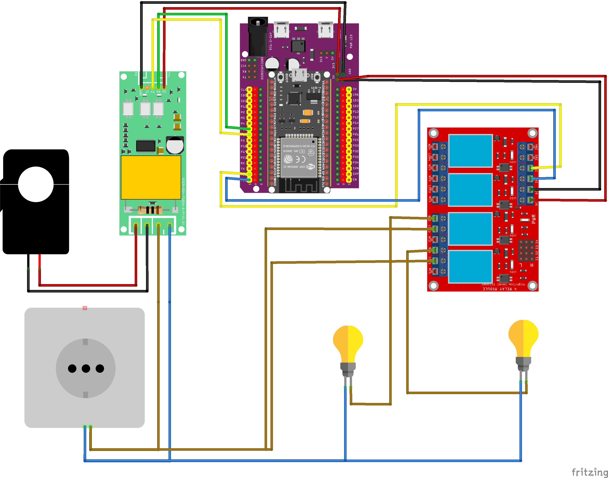

# ESP32 + PZEM-004T v3.0 Energy Monitor with Blynk

Monitor **Voltage, Current, and Power** from a **PZEM-004T v3.0** and control **two AC bulbs** via relays, with live dashboards in **Blynk (Web & Mobile)**.



---

## ✨ Features

* ESP32 + PZEM-004T v3.0 → real-time V/I/P/E readings
* Sends data to **Blynk Cloud** (Web & App dashboards)
* Control up to **2 relays** (bulbs, small appliances) from anywhere
* Safe wiring with CT clamp for current sensing
* Beginner-friendly: Arduino IDE only (no PlatformIO needed)

---

## 🛠 Hardware

* ESP32 Dev Board
* PZEM-004T v3.0 (with CT clamp)
* 2-Channel relay module (5V, active-LOW)
* 2 × AC bulbs + holders
* 3-pin fused plug (3A) + wiring accessories

---

## 🚀 Quickstart

1. Install **Arduino IDE** + **ESP32 board support**
2. Install libraries: `Blynk`, `PZEM004Tv30`
3. Clone this repo:

   ```bash
   git clone https://github.com/yoshiosenpai/esp32-pzem-blynk-energy-monitor.git
   ```
4. Copy `firmware/esp32_pzem_blynk/config.example.h` → `config.h` and add WiFi + Blynk token
5. Open `esp32_pzem_blynk.ino` → Select **ESP32 Dev Module** → Upload
6. Wire according to [docs/wiring-table.md](docs/wiring-table.md)
7. Open Serial Monitor → readings every \~2s
8. Open **Blynk Dashboard** → Voltage, Current, Power, Energy live + Relay switches

---

## ⚠️ Safety

This project involves **230 VAC mains**.

* Always use a **3 A fused plug**
* Keep wiring insulated and inside an enclosure
* Test with **low-wattage LED bulbs first**
* Not for heavy appliance loads

---

## 📂 Docs

* [Quickstart](docs/quickstart.md)
* [Wiring Table](docs/wiring-table.md)
* [Blynk Setup](docs/blynk-setup.md)

---

## 📜 License

MIT License – see [LICENSE](LICENSE).

